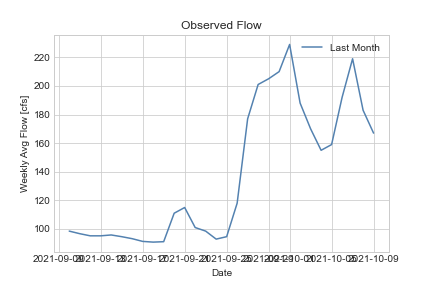
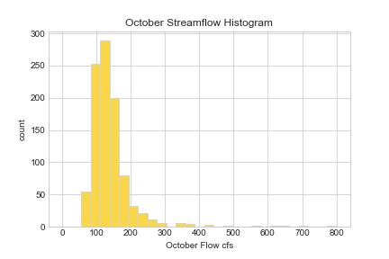
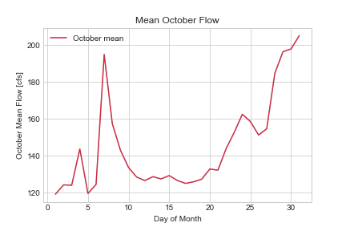
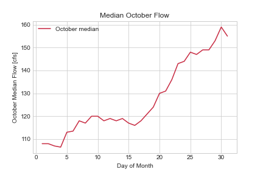

Homework 7 submission - by Andrew Hoopes

Python script instructions
In addition to downloading the most recent streamflow, there are a couple of variables which must be set in order for the script to run properly.  The variable date on line 118 must be set to 11, the 11th of October being the day when the forecast period starts.  On the line above, the variable precip should be set according to the level of precipitation expected during week 1 of the forecast period.  Using the NWS forecast accesible via https://forecast.weather.gov/MapClick.php?lon=-111.85758589999749&lat=34.56146253137916#.YV4DsCVlDYs, add up all the precip probabilities for each day (do not combine day and night probabilities, if both are greater than 0, use the greater of the two) and divide by 50%, rounding down to the nearest integer.  Example: 3 days of 30% would give a precip value of 1, adding a 10% day would increase the value to 2.  If no probability is given for a day, assume its value is 0.

Week 1 forecast: 145 cfs\
Week 2: Forecast: 146 cfs

Printed script outputs:\
"Week 1 forecast: 145 cfs \
Week 2 forecast: 146 cfs"

Saved figures:\
Figure 1:\

Figure 2:\

Figure 3:\

Figure 4:\

Code review:
1. Is the script easy to read and understand?\
Yes, however some of the comments were a little difficult to read because there weren't any spaces between different comments. This is the same case for the function comments. It's much easier to read and see if there are spaces in between the comment lines.
2. Does the code follow PEP8 style consistently?\
There are quite a few lines that are too long, per PEP8 standards. Also, when making a variable, there should be spaces on either side of the equal sign. There should also be spaces between commas when listing out variables (in the function parameters for example).
3. Is the code written succinctly and efficiently?
Yes, I believe so. I really liked the plots, I thought they were really cool and displayed the data well. However, again with the big blocks of comments, I just found them more challenging to read. I also found that the task regarding the precipitation index (using the NWS page) was a little confusing so I hope I did it correctly.
