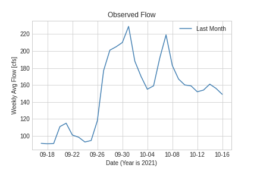
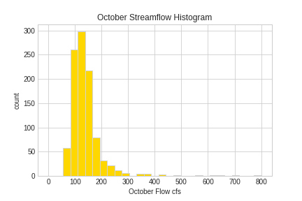
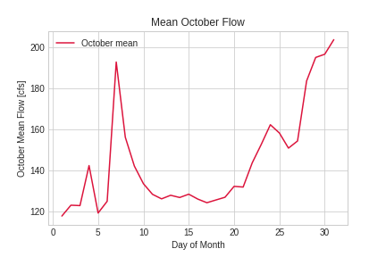
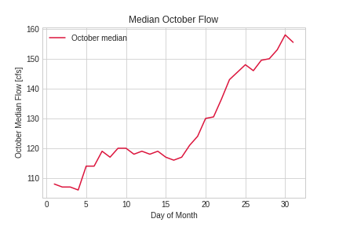

Homework 8 Submission - By Andrew Hoopes
___________
## Grade
### 1. Forecast Submision: 
**3/3**: Nice work and nice summary! I especially like your comparison of mean and median it really highlights the importance of outliers. 

### 2. Graded Script
Refer to [the rubric](https://github.com/HAS-Tools-Fall2021/Course-Materials21/blob/main/Content/Starter_Codes/week7_code_review_rubric.md) for details on scoring: 
- **Readability: 2.5/3** - Great job commenting. I just subtracted 0.5 because your doc strings were not quite formatted correctly. Missing data types and the one line summary. 
- **Style: 3/3** 
- **Code: 3/3** Awesome! I ran it with no trouble and I really love your use of groupby and also the function that you made and how it includes the precip forecast.
___________

Week 1 Forecast: 128 cfs

Week 2 Forecast: 161 cfs

1.  Similarly to last week, I made my forecast based on the current flow (last availiable observation), the climatology for the month of October using the mean and median flow (week 2 forecast period ends on Oct 31), and for week 1, the relative chance of precipitation, as a rain event can increase flow and a lack of rain can decrease it.  For week 1, the current flow is weighted equally to the mean and median climatology combined (current conditions should have a large influence) while both climatologies are weighted higher for the second week (further out, a return to the mean can be expected).  For the first week, an additional multiplier is applied based on the number of days precipitation can be reasonably expected (NWS probability >50%, accumulates day to day until threshold reached).  Zero precipitation decreases the expected flow by 10%, while 2 rainy days will increase the forecast by 10%, with an additional 10% increase for each additional rainy day.

2. 

   Plot of flow over last 30 days: gives an idea of current trends, last point used for observational value.

   

   Histogram of October flows - Introuction to the monthly climatology, majority of values within a certain range, forecasts should not be outside of it.

   

   Plot of 1989-2021 mean October flows - Gives an idea of what flows can be reasonably expected based on previous years' conditions, forms half of the climatology used to make the forecast.

   

   Plot of 1989-2021 median October flows - Similar to the mean plot, but gives additional avantage of filtering out outliers, forms other half of the climatology used to make the forecast.

3. Most of the comments from my partner had to do with the easiness of my code to understand.  while the code itself was well-written, the comments and the function description needed cleaning up to be more easily understandable.  A big point of concern came from how to set the precipitation index.  I myself realized beforehand that part might be confusing, and did my best to explain it, nonetheless, I improved both my comments, the function description, and the methodology and rationale behind my forecast code.  Additionally, several areas failed to follow pep8 format, I corrected each such issue to improve readability.

4. Timeseries functionality was already being used, as the initial starter code used the parse dates statement to read in the datetime column.  However, I made several improvements to said functionality, mainly in cleaning up my plot of the flow over the previous 30 days.  First, once all the columns were created, I set the dataframe index to datetime, making working with and plotting datetime easier, as well as allowing for simpler referencing/indexing.  Next, I used the DateFormatter and DayLocater methods from matplotlib.dates, being sure to import them at the top of the code beforehand.  DateFormatter was used to change the x-axis labels on the plot to only show the month and day, as the year was always 2021 on that plot, while DayLocator was used to set the tick and label increments to 4 days.  These changes combined made the plot much more readable, as datetime labels were evenly spaced (no lnger reset with month) and no longer overlapped with each other thanks to the removal of the year, unecessary due to being a constant value.

5.  The part of the code I am most proud of is older and does not use timeseries functionality, but uses Pandas Dataframes in a way that was only brought up in class this past week.  This part of the code uses the groupby Pandas method to group the data by day of the month (October data is already isolated using additional Pandas functionality) and take the mean and median of the flow values for each day.  Only 2 lines of code are needed, one for the mean an one for the median, and 2 Pandas series are output, the daily means/medians indexed by the day of the month.  Both series are then plotted.  The simplicity and shortness of these methods, and their functiionality in obtaining two key forecast parameters from a much larger dataset, are reasons for me being proud in this part of the code.
