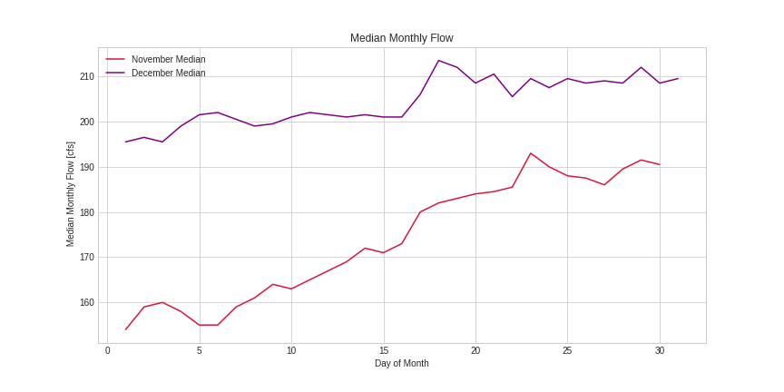

Homework 9 submission - by Andrew Hoopes

Week 1 forecast: 166 cfs

Week 2 forecast: 160 cfs

1. For this week's forecast, I added to my precipitation component by considering climatological precipitation in the region, for locations both nearby (Prescott, Camp Verde) and upstream (Flagstaff) of the forecast point, calculating the probability of precipitation for any given day of the month and generating an index similar to the ones last week based on that probability.  Probability indices were generated for each site/dataset, and averaged to create a combined probability, multiplied by 7 to get a weekly index.  This climatological index was then compared to the forecast index, generated the same way as the previous week; the comparison replacing the arbitrary expectation of 1 precip day per week used last week.

2. For this week's forecast, 3 datasets were added.  2 of them came from the mesonet site, they were both 24-hour precipitation datasets, created with official airport METAR data, one from Prescott airport, the other from Flagstaff airport.  These 2 sites were chosen because of the proximity to the forecast site (Prescott) and upstrem feeder areas (Flagstaff), the relative convienence of the 24-hour accumulation format for measuring precip (probabilities based around daily values) and the length of data availiable (October 2000 for both sites).  The third dataset was from Camp Verde itself, taken from interpolated data on the Daymet site.  Although unofficial, the data here went back longer (could be matched with 1989 flow period start), and had a 24-hourly option.  This data was seen to match up well with the official airport measurements (see plot for Q3).
Data access was straightforward, done through the methods described in class, plus a few alterations to account for the differing variables.  The Daymet data was simple, accesed straight from the starter code using the csv format method.  Alterations needed to be made to the mesonet data; first a user-specific access token had to be generated and input.  The variable name and its associated units in the url also had to be changed; the name of the 24-hour precipitation field was foun by viewing the data description online.  The station ID was changed to KPRC for Prescott and KFGZ for Flagstaff (all airport METAR sites start with a K).
The need for manipulation did not end once the Pandas dataframe was created.  Despite being daily accumulations, the timesteps were not daily, with every non-daily timestep returning a NaN value.  The resample method got around this method upon being set to only take the rows with the max precipitation value.  This did not completely eliminate the NaNs, as days with no precipitation still returned NaNs for daily values.  The method .fillna(0) was used to reset these NaNs to the proper value, and the data was ready to be worked on.

3. 

Only mean climatology is included here, as the amount of dry days in October was high enough to ensure that all days returned a median accumulation of 0 mm.

4. 

]
